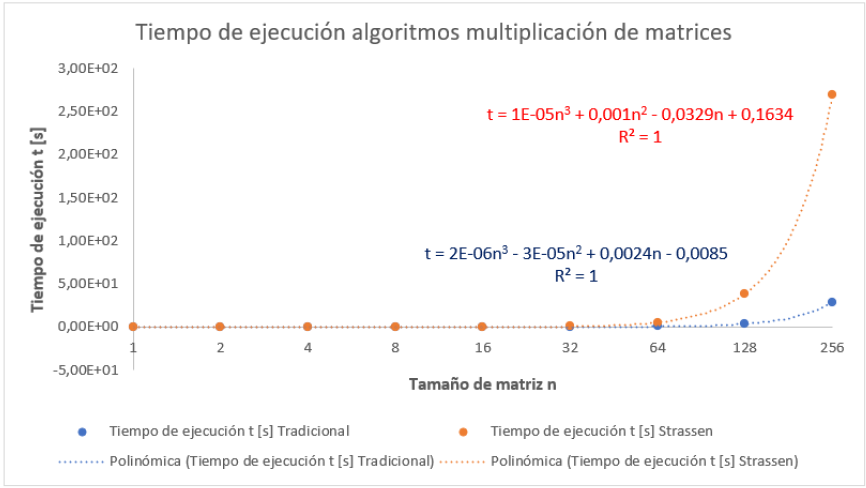

# Nombre del Proyecto
T2

# Descripción
Implementación en Python y análisis del tiempo que toma el algoritmo tradicional v/s el algoritmo de tipo Dividir y Conquistar de Strassen para calcular la multiplicación de dos matrices

El algoritmo tradicional obtiene el valor M[i][j] (para una matriz M de dimensiones n x n), recorriendo la fila i de la matriz M1 y la columna j de la matriz M2, multiplicando los elementos correspondientes y luego sumándolos. Este algoritmo tiene un tiempo de ejecución teórico Θ(n^3)

Por otro lado, el algoritmo de Strassen utiliza un enfoque del tipo dividir y conquistar, dividiendo las matrices M1 y M2 en 4 submatrices de dimensiones (n/2) x (n/2) cada una. El algoritmo de Strassen optimiza el método más directo de dividir y conquistar, resolviendo 7 subproblemas en vez de 8. Esto resulta en un tiempo de ejecución teórico de Θ(n^2.81)

El algoritmo fue implementado un programa en Python, capaz de ejecutar ambos métodos sobre una entrada de dos matrices, obteniendo sus respectivos tiempos de ejecución para motivos de comparación.

| Tamaño de matriz n x n | Tiempo de ejecución t [s] Tradicional | Tiempo de ejecución t [s] Strassen |
|------------------------|--------------------------------------|----------------------------------|
| 1                      | 9.98E-04                             | 9.98E-04                         |
| 2                      | 2.01E-03                             | 2.01E-03                         |
| 4                      | 2.00E-03                             | 5.00E-03                         |
| 8                      | 8.00E-03                             | 2.90E-02                         |
| 16                     | 1.40E-02                             | 1.34E-01                         |
| 32                     | 7.90E-02                             | 7.91E-01                         |
| 64                     | 4.94E-01                             | 5.01E+00                         |
| 128                    | 3.52E+00                             | 3.86E+01                         |
| 256                    | 2.87E+01                             | 2.69E+02                         |

Los resultados observados no fueron los esperados, puesto que, teóricamente, el algoritmo de Strassen debería tener un tiempo de ejecución más bajo respecto al algoritmo tradicional, a medida que n tiende hacia valores altos.

Es posible que este problema se deba al uso de Python, ya que al ser un lenguaje interpretado, tiene un tiempo de ejecución más alto respecto a los lenguajes compilados (como C/C++), particularmente en lo que concierne a funciones recursivas.

# Herramientas utilizadas
Se ha comprobado el correcto funcionamiento del proyecto con las siguientes versiones:

- Python 3.12.0

# Instalación
1. Descargar e instalar Python

# Uso
1. Clonar el repositorio
2. Acceder a la carpeta del repositorio
3. Abrir el terminal, ejecutar el programa con `python T2.py`